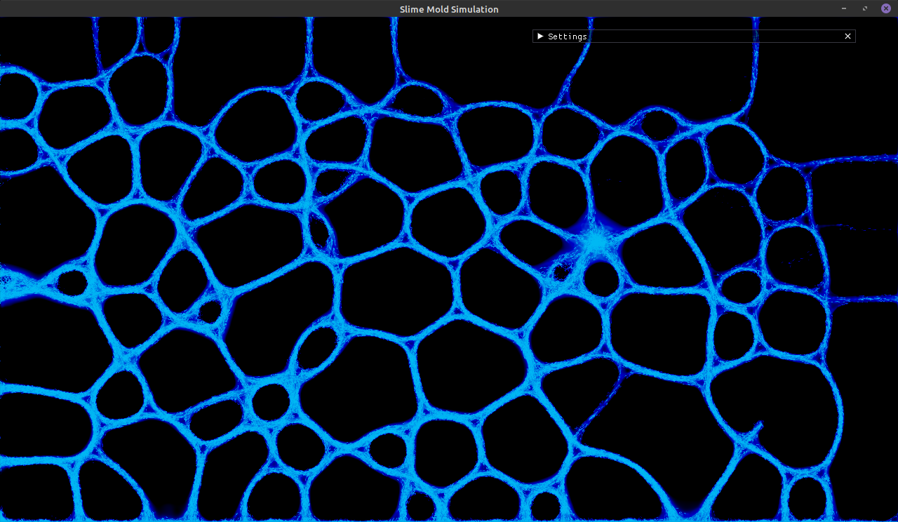
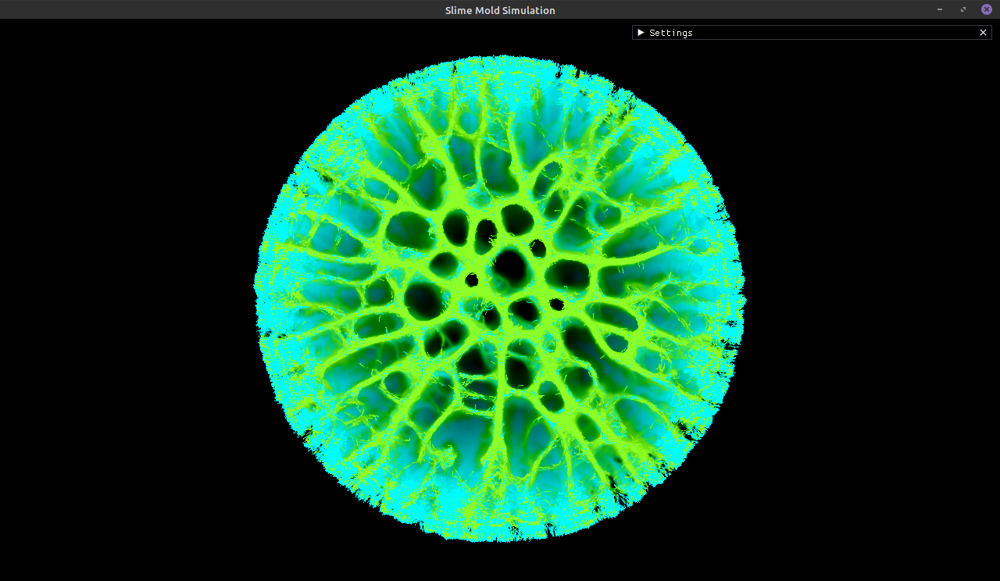
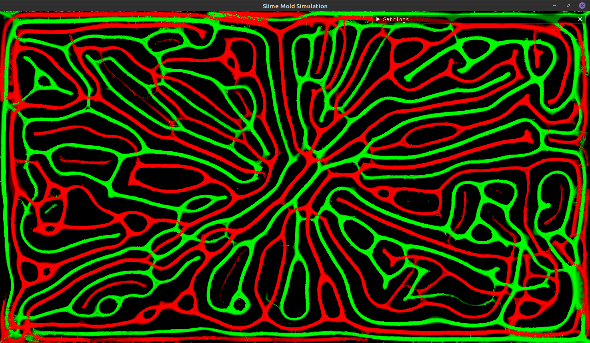

# Slime Mold Simulation

This is a simulation of a slime mold written in C++ implemented as an OpenGL compute shader.  

The simulation has a few basic controls that can be manipulated at runtime:

- ### Settings:
    - Color: The main color of agents in the simulation.
    - #### Effect Settings:
        - Blur: Enables or disables blurring.
        - Diffuse Speed: How fast the agent's trails will diffuse.
        - Evaporate Speed: How fast the agent's trails will evaporate.
        - Color Mod: This a modification to the resulting color after the applying the effects. This color is subtracted
          from the diffused and evaporated value.  
          Ex: A color mod of (R:0.0, G:0.0, B:1.0) will remove all blue from the resulting blur.
    - #### Agent Settings:
        - Speed: How fast the agents are able to move.
        - Turn Speed: How fast the agents are able to turn towards another. This is only applied to the agents angle and
          does not affect their overall speed.
        - Sensor Offset Distance: How far away each agent will look for other agents.
        - Sensor Angle Offset: An offset to the agent's current angle, determines the angle that agents can sense each
          other at.
        - Sensor Size: The distance in which an agent can sense another in every direction.
        - Color: The color of the agent, also determines whether the slime can sense another species.          

### More Images

---

---

### Real Slime Mold

### Future Plans

I would like to add brushes that allow the user to create new agents using the mouse. When the mouse is clicked and the
simulation is running I would like to push the agents away from the mouse.  
S